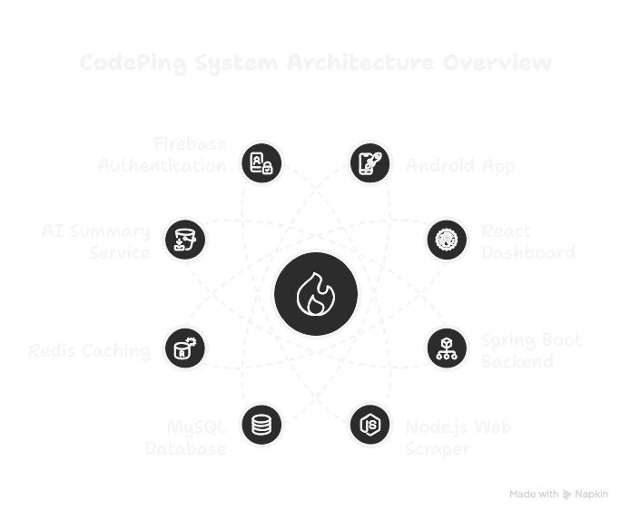

# CodePing — CP Tracker & Profile Sharing App

CodePing is a cross-platform competitive programming tracker system that helps users monitor their progress, receive contest notifications, and showcase their profiles from platforms like LeetCode, Codeforces, and CodeChef.

The system follows a modular microservices architecture with dedicated services for data scraping, aggregation, AI-based insights, and user interaction through Android and Web interfaces.

---

## 🚀 System Architecture

CodePing consists of the following components:

- **Android App (Jetpack Compose):**  
  User-facing mobile app offering contest alerts, progress visualization, and profile linking.

- **Public Web Dashboard (React):**  
  Interactive public-facing profile dashboard accessible via shareable links.

- **Backend Services (Spring Boot Microservices):**  
  - API Gateway and User Service (Firebase Authentication).  
  - Data Aggregation Service (handling CP platform data).  
  - AI Summary Service (powered by AWS Bedrock and Spring AI).  

- **Web Scraper (Node.js):**  
  Scrapes user data from LeetCode, Codeforces, and CodeChef; deployed on Render with Swagger API documentation.

- **Databases:**  
  PostgreSQL for structured storage and Redis (optional) for caching.

---

## 📂 Project Components

- [Android App (Jetpack Compose)](https://github.com/gowtham-2oo5/CodePing-Android) - WIP
- [Backend APIs (Spring Boot)](https://github.com/gowtham-2oo5/CodePing-Backend) - WIP
- [Web Scraper Service (Node.js)](https://github.com/gowtham-2oo5/codechef-scraper)
- [Public Profile Dashboard (React)](https://github.com/gowtham-2oo5/CodePing) - WIP

---

## 💡 Key Features

- ✅ Contest notifications for LeetCode, Codeforces, and CodeChef.
- ✅ Progress tracking with performance graphs and history.
- ✅ AI-powered submission summaries and performance insights using AWS Bedrock + Spring AI.
- ✅ Public profile dashboards with user ratings, contests, and submission timelines.
- ✅ Modular backend services with Swagger-documented APIs and a scalable architecture.

---

## 🤝 Contributions

Pull requests, ideas, and feedback are welcome. Please check the [Issues](https://github.com/gowtham-2oo5/CodePing/issues) section to get started.
